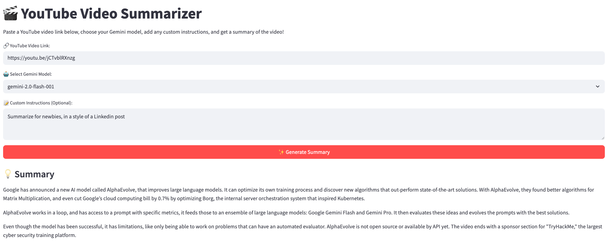

<!-- # Copyright 2025 Google LLC
#
# Licensed under the Apache License, Version 2.0 (the "License");
# you may not use this file except in compliance with the License.
# You may obtain a copy of the License at
#
#      http://www.apache.org/licenses/LICENSE-2.0
#
# Unless required by applicable law or agreed to in writing, software
# distributed under the License is distributed on an "AS IS" BASIS,
# WITHOUT WARRANTIES OR CONDITIONS OF ANY KIND, either express or implied.
# See the License for the specific language governing permissions and
# limitations under the License. -->

# Gemini YouTube Summarizer on Cloud Run

**[Blog post](https://yorko.github.io/2025/youtube-summarizer-cloud-run/)**

Gemini is pretty good with YouTube analysis. Let's build and deploy a web application that summarizes YouTube videos using Google's Gemini and deploy it with Google Cloud Run.



_This tutorial is a modernized version of the code lab [Build a YouTube Summarizer Codelab](https://codelabs.developers.google.com/devsite/codelabs/build-youtube-summarizer)._

## Description

The application presents a web interface where users can input a YouTube video link, select a generative AI model (currently defaults to Gemini 2.0 Flash), and optionally add a specific prompt for the summarization task. Upon submission, the backend Fast API application uses the Google GenAI client library to interact with the chosen model, sending the video content and prompt to generate a text summary. The summary is then displayed to the user.

## Features

* Summarizes YouTube videos using Google Gemini Flash model;
* Simple web interface for inputting video links and prompts;
* Built with Python and Fast API;
* Designed for deployment on Google Cloud Run;
* Includes a script for building the container image and deploying to Cloud Run.

## Prerequisites

* Python 3.x;
* Google Cloud SDK (`gcloud`) installed and configured;
* A Google Cloud Project with billing enabled;
* Required APIs enabled in your Google Cloud Project (Cloud Build, Cloud Run, IAM, Vertex AI, etc. - refer to deployment scripts for specifics);
* Docker (for local building if not using Cloud Build).

## Installation & Setup

1. Install `uv` – the modern Python dependency manager:

    ```bash
    pip install uv
    ```

2. Create a virtual env:

    ```bash
    uv venv
    ```

3.  Install Python dependencies with `uv`

    ```bash
    uv sync
    ```
    This will install Fast API, requests, and google-genai listed in the `pyproject.toml` file.

4.  Configure Google Cloud:
    * Set your project ID: `gcloud config set project YOUR_PROJECT_ID`
    * Ensure your user account or service account has the necessary permissions (e.g., Cloud Run Admin, Cloud Build Editor, Service Account User, Vertex AI User).

## Local usage

1. Run the Fast API backend:
    ```bash
    make run_backend
    ```
1. Run the Streamlit frontend (in a different terminal tab/window):
    ```bash
    make run_frontend
    ```
1.  Access the application in your web browser: `http://localhost:8501`
1.  Enter a YouTube video link (e.g. this one https://youtu.be/jCTvblRXnzg on AlphaEvolve by DeepMind), optionally add a prompt, and click "Generate Summary".

## Deployment to Google Cloud Run

The project includes a script to automate the build and deployment process.

1.  Review and modify `build_n_deploy.sh`:** Update `PROJECT_ID`, `PROJECT_NUMBER`, `SERVICE_NAME`, `DEPLOY_REGION`, and `SERVICE_ACCOUNT` variables as needed for your environment.
1.  Build the container image using Google Cloud Build:
    ```bash
    make build_cloud_image
    ```
1.  Deploy the service to Cloud Run:
    ```bash
    make deploy_cloud_run_service
    ```
    This command deploys the container image built in the previous step, configuring the service account, minimum instances, memory, and allowing unauthenticated access by default. The script will output the URL of your deployed Cloud Run service. Visit this URL to test your deployed YouTube Summarizer!
1. In case your organization doesn't allow unauthenticated access, you can proxy the service to localhost:
    ```bash
    gcloud run services proxy ${SERVICE_NAME}
    ```

Just like with locally run application, this will open the app at [https://localhost:8080](https://localhost:8080/).


## Bonus Challenges (Optional):

* Explore the `scripts/enable_oauth_for_cloud_run.sh` script. Understand how it sets up a Load Balancer and Identity-Aware Proxy (IAP) to restrict access to authenticated users. Try implementing it for your service;
* Modernaize the app: split front & back into different services and use `cloudbuild.yaml` to specify different Docker files for them;
* Experiment with prompting.

Good luck hacking!
